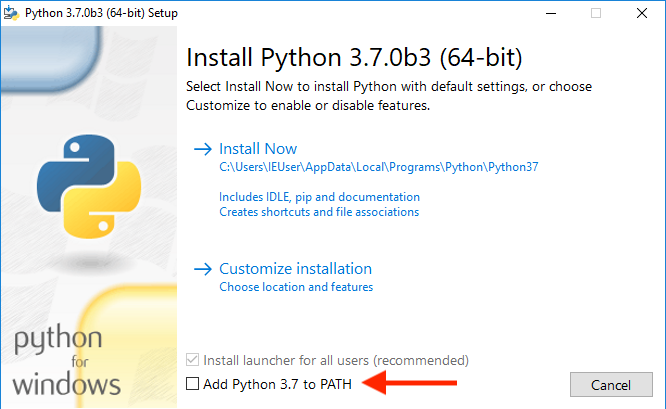
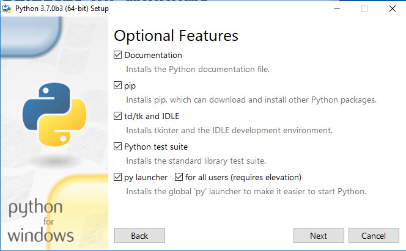
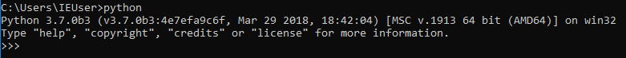
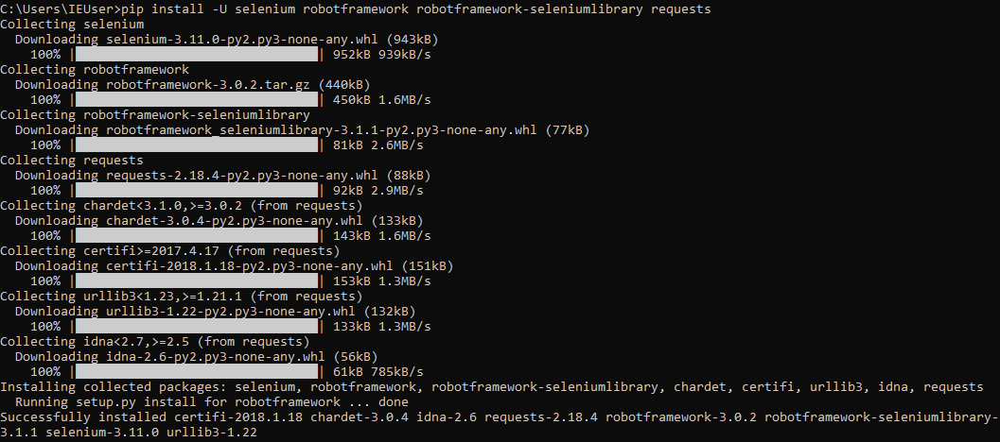
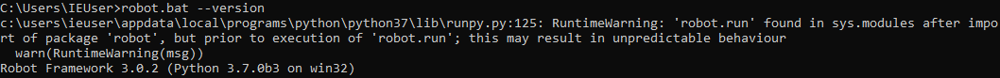
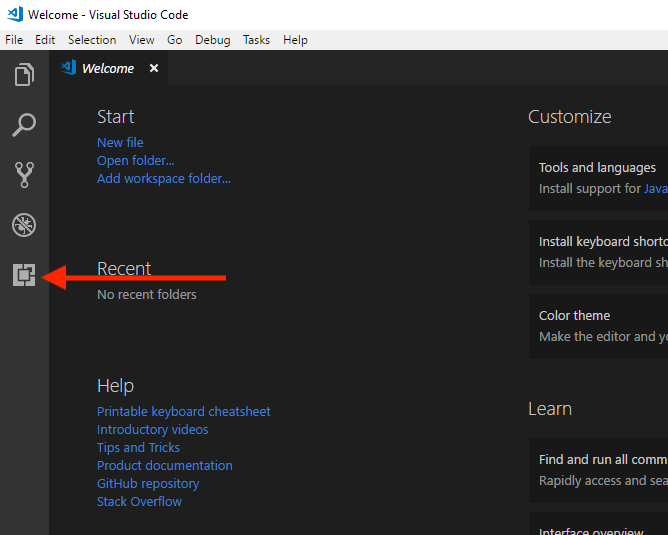
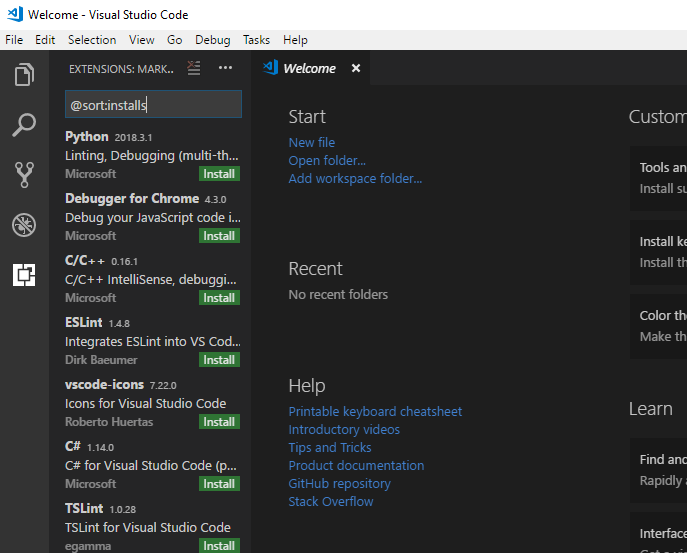
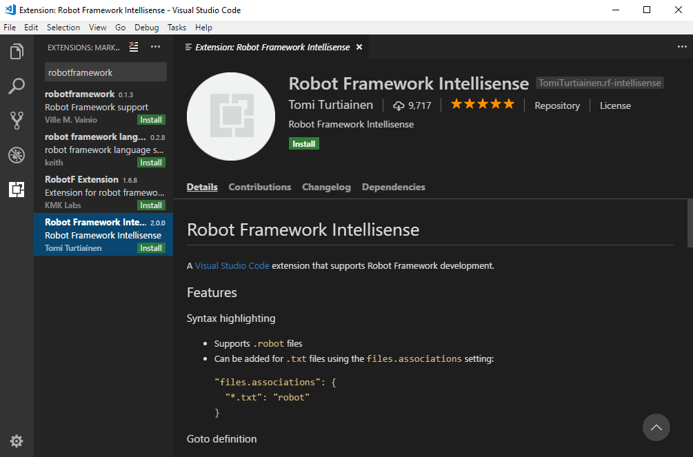
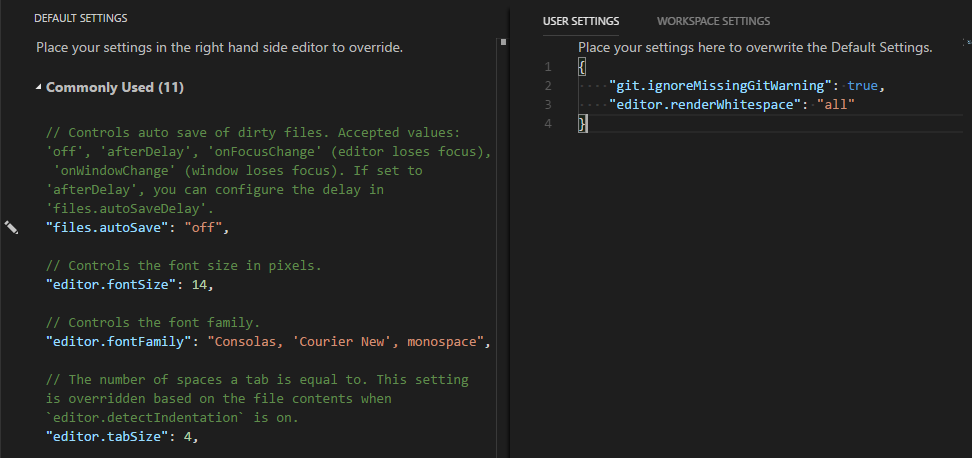

# Setup Guide for Setting Up Robot framework on Windows environment

By following this guide, you will get a windows environment with tools for developing and executing robot framework.

## Checklist

- [Python 3 with pip](#install-python-3-with-pip)
- [Robot framework dependencies](#install-robot-framework-dependencies)
- [Chrome Browser](#install-chrome-browser)
- [Chrome Web Driver](#install-chrome-web-driver)
- [Visual Studio Code](#install-visual-studio-code)
- [Visual Studio Code extensions](#install-visual-studio-code-extensions)
- [Customize Visual Studio Code](#customize-visual-studio-code)

## Before you go

It will be easier if you use scoop or chocolatey to install packages. This guide provides only guide for installing package manually.

### Install Python 3 with pip

1. Download the latest version of python 3 from https://www.python.org/downloads/windows/.
2. Install python by checking *Add Python 3.x to PATH* and select install python with *Customize Installation* option.

    

3. Make sure you select *pip* check box.

    

4. Continue installation by clicking Next button.
5. From now on, you should be able to run from command line.

    

### Install Robot framework dependencies

1. Open command line and run `pip install -U selenium robotframework robotframework-seleniumlibrary requests` to install dependencies for robot framework.

    

2. You can check if robot framework is now installed by running `robot --version`, robot framework version should be displayed.

    

3. Do not worry about warning. It is a known issue to robot framework team.

### Install Chrome Browser

1. Download and install the latest version of Chrome Browser from https://www.google.com/chrome/.

### Install Chrome Web Driver

1. Download the latest version of Chrome Web Driver (chromedriver) from https://sites.google.com/a/chromium.org/chromedriver/downloads.
2. Extract the executable file into a folder.
3. Add the destination folder to PATH environment.

### Install Visual Studio Code

1. Download and install the latest version of visual studio code from https://code.visualstudio.com/.

### Install Visual Studio Code extensions

1. Open Visual Studio Code.
2. Open Extension Panel by clicking Extension icon.

    

3. In extension panel, search for *Robot Framework Intellisense*.

    

4. Install Robot Framework Intellisense and reload Visual Studio Code after install.

    

### Customize Visual Studio Code

1. Open Visual Studio Code.
2. Open Settings (File > Preferences > Settings).
3. Change "editor.renderWhitespace" to "all" by clicking the pencil icon in front of "editor.renderWhitespace" option. The entry of "editor.renderWhitespace": "all" will be added into right panel.
4. All spaces will be rendered as a dot.

    
